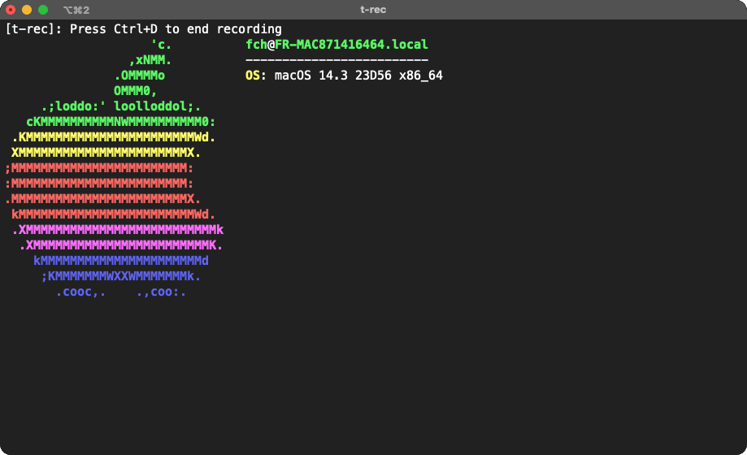
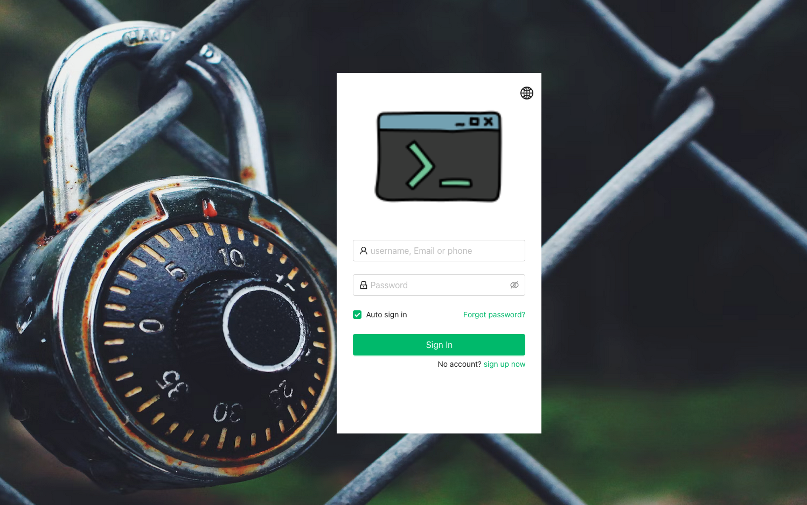
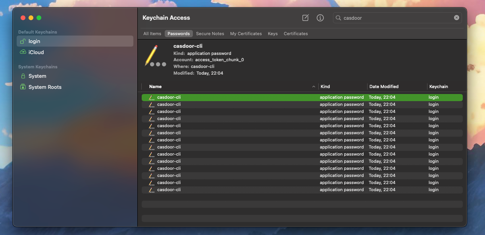
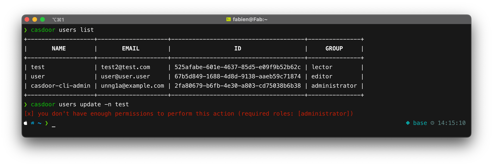
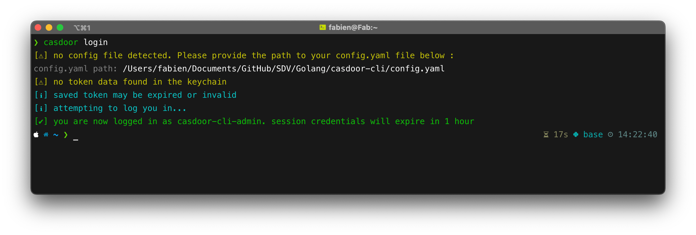

# Casdoor CLI

[](https://opensource.org/licenses/Apache-2.0)
[](https://goreportcard.com/report/github.com/casdoor/casdoor-cli)
[](https://github.com/casdoor/casdoor-cli)
[](https://github.com/casdoor/casdoor-cli/releases)
[](https://discord.gg/5rPsrAzK7S)

*An official command line interface for Casdoor - The Open Source Identity and Access Management (IAM) / Single-Sign-On (SSO) platform powered by OAuth 2.0, OIDC, SAML and CAS.*



<!-- TOC -->
* [Casdoor CLI](#casdoor-cli)
  * [Description](#description)
  * [Usage](#usage)
  * [Features](#features)
  * [Installation](#installation)
    * [Prerequisites](#prerequisites)
    * [macOS](#macos)
    * [Linux](#linux)
    * [Configure Your Shell](#configure-your-shell)
  * [Configuration](#configuration)
    * [Casdoor Server Setup](#casdoor-server-setup)
    * [CLI Configuration](#cli-configuration)
  * [Development](#development)
    * [Local Development Environment](#local-development-environment)
    * [Development Configuration](#development-configuration)
    * [Testing the CLI](#testing-the-cli)
  * [Contributing](#contributing)
  * [License](#license)
  * [Support](#support)
<!-- TOC -->

## Description

**Casdoor CLI** is the official command-line interface for [Casdoor](https://casdoor.org), providing a powerful and intuitive way to manage your Casdoor identity and access management system directly from the terminal.

### Key Capabilities

- **User Management**: Create, update, and delete users with ease
- **Permission Management**: Control user permissions through Casdoor's group feature with built-in roles:
    - `lector`: Read-only access
    - `editor`: Can create users, with limited modification rights
    - `administrator`: Full control over user creation, modification, and deletion
- **Group Management**: Create, modify, and delete user groups
- **OAuth2 Authentication**: Secure browser-based login flow using Casdoor's OAuth2 implementation
- **Secure Credential Storage**: Integration with system keyring for safe token storage

The CLI leverages Casdoor's group-based permission model to provide fine-grained access control. Permissions are automatically managed based on group membership, ensuring secure and consistent authorization across your Casdoor instance.

## Usage

**Platform Support**: Currently supports macOS and Linux (tested on Debian 12 and macOS Sonoma). Windows support via WSL is not available as the CLI requires GNOME's Secret Service DBus interface (GNOME Keyring) for secure credential storage.

```
Usage:
  casdoor [command]

Available Commands:
  completion  Generate the autocompletion script for the specified shell
  groups      Manage Casdoor permissions
  help        Help about any command
  login       Login to your Casdoor account
  logout      Logout from your Casdoor account
  users       Manage Casdoor users

Flags:
  -d, --debug   verbose logging
  -h, --help    help for casdoor

```

## Features

### OAuth2 Browser-Based Authentication

Securely authenticate with your Casdoor instance using a browser-based OAuth2 flow:



### Secure Token Storage

Credentials are safely stored using your system's keyring interface, ensuring tokens never touch disk in plaintext:



### Fine-Grained Permission Management

Role-based access control with granular permissions:



## Installation

### Prerequisites

- Go 1.22.0 or higher
- macOS or Linux operating system
- GNOME Keyring (Linux) or Keychain (macOS) for secure credential storage

### macOS

```bash
make build TARGET_OS=darwin && make install TARGET_OS=darwin
```

### Linux

```bash
make build TARGET_OS=linux && make install TARGET_OS=linux
```

### Configure Your Shell

After installation, add `casdoor-cli` to your `PATH`:

**For Bash users:**
```bash
echo 'export PATH="/usr/local/bin:$PATH"' >> ~/.bashrc
source ~/.bashrc
```

**For Zsh users:**
```bash
echo 'export PATH="/usr/local/bin:$PATH"' >> ~/.zshrc
source ~/.zshrc
```

Verify the installation:
```bash
casdoor --help
```

## Configuration

### Casdoor Server Setup

To use the CLI, you need a configured Casdoor application. You have two options:

1. **Using the provided bootstrap data**: An `init_data.json` file is included to quickly bootstrap Casdoor's configuration. Refer to the [official Casdoor documentation](https://casdoor.org/docs/deployment/data-initialization/) for initialization instructions.

2. **Manual configuration**: Create an application directly in your Casdoor admin panel and configure it according to your requirements.

### CLI Configuration

On first launch, `casdoor-cli` will prompt you to provide a `config.yaml` file containing your Casdoor connection details. See the included `config.yaml.example` file for reference.



**Required configuration fields:**

```yaml
application_name: your-app-name
casdoor_endpoint: https://your-casdoor-instance.com
certificate: |
  -----BEGIN CERTIFICATE-----
  Your certificate content here
  -----END CERTIFICATE-----
client_id: your-client-id
client_secret: your-client-secret
organization_name: your-organization
redirect_uri: http://localhost:9000/callback
```

Your configuration will be securely stored in `~/.casdoor-cli/config.yaml` (base64 encoded) for subsequent use.

## Development

### Local Development Environment

A Docker Compose environment is provided for local testing and development:

```bash
docker compose up -d
```

**Note**: Allow a few moments for the Casdoor container to fully initialize. The container will restart multiple times as it sets up the database.

### Development Configuration

Create a `config.yaml` file from the provided `config.yaml.example` template at the repository root:

```yaml
application_name: casdoor-cli
casdoor_endpoint: http://localhost:8000
certificate: |
  -----BEGIN CERTIFICATE-----
  MIIE3TCCAsWgAwIBAgIDAeJAMA0GCSqGSIb3DQEBCwUAMCgxDjAMBgNVBAoTBWFk
  bWluMRYwFAYDVQQDEw1jZXJ0LWJ1aWx0LWluMB4XDTI0MDQwMTIxNTgwOVoXDTQ0
  MDQwMTIxNTgwOVowKDEOMAwGA1UEChMFYWRtaW4xFjAUBgNVBAMTDWNlcnQtYnVp
  bHQtaW4wggIiMA0GCSqGSIb3DQEBAQUAA4ICDwAwggIKAoICAQDB7cZzw4VWg5Ys
  MCfsqLfOB8elKtGYZXjIWRUAwWR++EO4y/+6A6BofKibH7hhP39hOhJM6b5KLNZQ
  S368DcVOiIOpvSm/MwkZl0lFz3XHRjU4ZliNdCw8MMIEEhaH20d/SnqAiyPTqryP
  RNYV8ZnjsnSQ/wGCMwu9Yo7ruTXvxaI3YCDkG+QqWbMjFo1UERYlpXH5N0eVGdTw
  JDWSx0WDTJSY1tJej2d6Ca2quQZRkl32i9Ggdi7sPdB0EVnZe2pwwBHreQMsCyMd
  LErioPjjg8HMfYtCMuxsU/i/hiLFk2xIafxvSTNC6oLRJoi6OlRb6NZGmiQI7bk9
  VXy8NFzuYcGpJngBrqRLkt5xBkZ5c97zKgJT+wRutnQ+qRYCsIDx0eND7iv+lr++
  K2m686gOgzywk3bA7TLJkS19qyIbDpqRMiVhuAociQIoWpWq2ALoUuFMTafOOX0e
  nmFk5yQqqXMp7MRJSaaXhlCcI76G2P4xohzs3rilwBer51F1CADedGiuVrCca1Ly
  tXa2zX7KDu9y4x93KOmKqJGDH6y/hhFneTdP4/x5cOFBwYV8hM63RsM8b2cgeQeD
  mjPM3YX0a+YCNJXcRicumkskd1FhibpH7gtGGmpTyHbKLAQFoRnyKjnQ+4exWJ9Q
  rPWghJW3Cyutjy/a10yVBQ/DbDgquwIDAQABoxAwDjAMBgNVHRMBAf8EAjAAMA0G
  CSqGSIb3DQEBCwUAA4ICAQBzhd9/zJ0krEz3EnvAtSP6PTn2jjUW8i9Cf5c0l1MC
  Alz9J09vAJK9gLiYu9CySDKvvVeWJCowNsNJrQfHDVUtvRvIemwB/O2zXcIv3kCh
  RT5v1psDYyABBdgEOWxOIsndqh0xLMMC3TgTH3H3MPrNgQOSB9fy2UEFFoPD4Zkq
  PFY/uOfUaSDN2s4NrdlUF9ca5KPYvACV23QnZxprI0CWKP+MLbJqvsihjuMbRJad
  6cjin+dfs7jgg3nR7lMnPEF+ddleA8I4SJZyy9Q3kJtGHRO4aW84jioEKjuu/h/Z
  p5/4M/PObCA7H+vvr//iGTmSvlW+hzUE6w8qWwVEzozGXcRHa10lOZS087Wx3/b0
  +JY8WrVbz05EvvYrRvXXV81FQHYZlGFRMezAUHGq9Qron68YMVforDzvBgxWdiJD
  IOKK11AaKyWQXes7PQKC2K5Yhg08GMgQXtatR1RpUA3HYuqKG+s3zlfUqRh5giAr
  Xt+YV6bLdjlWxzYBQQb74WeC6g4YhpW4JOgHJ1tM7El/Ir6kE4QaN/7PM66AVy2C
  YTLrf5M8R2uASo+1pX4INeBoR8qQIVhkW9KWZHVJXRlhnHbhgSbqshjWVvJHcODN
  Iglj/acHnQtuMf9sTL6d4eeb99K/nOClh5lNtFLNjy2GPXZVDIfWbEpaBza9kJjc
  7A==
  -----END CERTIFICATE-----
client_id: ae8ae52c43d23fe00683
client_secret: 504df32f2134b3176df2c3eade455319706aeba1
organization_name: casdoor-cli
redirect_uri: http://localhost:9000/callback
```

### Testing the CLI

Test the login functionality with the default development credentials:
- **Username**: `casdoor-cli-admin`
- **Password**: `123456`

**Run directly with Go:**
```bash
go run main.go login
```

**Or build and install first:**
```bash
make build TARGET_OS=darwin && make install TARGET_OS=darwin  # For macOS
# OR
make build TARGET_OS=linux && make install TARGET_OS=linux    # For Linux

casdoor login
```

## Contributing

We welcome contributions! Please feel free to submit issues, fork the repository, and send pull requests.

## License

This project is licensed under the Apache License 2.0 - see the [LICENSE](LICENSE) file for details.

## Support

- **Documentation**: [Casdoor Official Documentation](https://casdoor.org/docs/overview)
- **Discord**: [Join our Discord community](https://discord.gg/5rPsrAzK7S)
- **GitHub Issues**: [Report bugs or request features](https://github.com/casdoor/casdoor-cli/issues)

