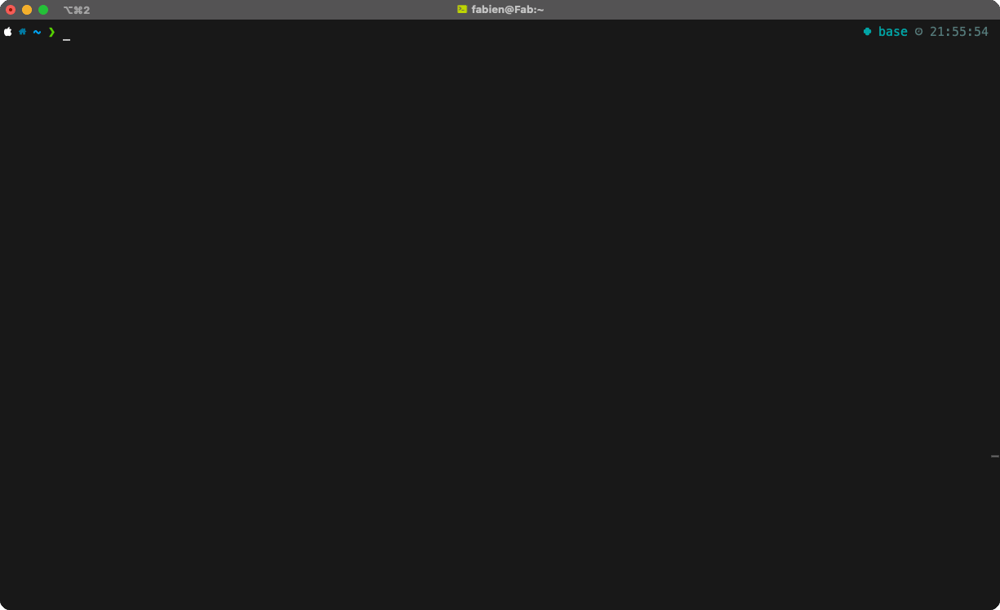

# Casdoor CLI


*A clean and straightforward command line interface for Casdoor.*



> ⚠️ This is a student project, and it is not officially supported nor affiliated with Casdoor. Please use with caution.

## How to install

### MacOS

```bash
make build
```


