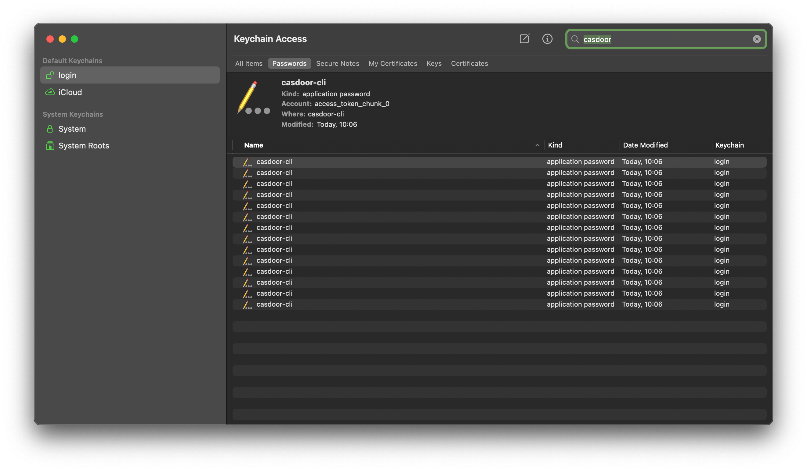

# Casdoor CLI


*A clean and straightforward command line interface for Casdoor.*


> ⚠️ This is a student project. I will probably try to release a complete version in the near future as no Casdoor CLI is available yet. For now, this CLI is just a proof of concept.

<!-- TOC -->
* [Casdoor CLI](#casdoor-cli)
  * [Description](#description)
  * [Usage](#usage)
  * [Features](#features)
  * [How to install](#how-to-install)
    * [MacOS](#macos)
    * [Linux](#linux)
  * [Configure](#configure)
    * [Casdoor configuration](#casdoor-configuration)
    * [Casdoor Cli](#casdoor-cli-1)
  * [Test and development](#test-and-development)
    * [Development backend](#development-backend)
    * [Configuration](#configuration)
<!-- TOC -->

## Description

Currently, `casdoor-cli` provides a command line interface able to : 

- Manage users in Casdoor (create, edit, delete)
- Manage users permissions within Casdoor using Casdoor's group feature. Built-in roles are the following :
    - `lector` : read access only
    - `editor` : can create users, but cannot edit users nor delete users
    - `administrator`  : can create, delete, and edit users
- Manage users groups within Casdoor (create, edit, delete)

Currently, permissions management is handled using Casdoor's Group feature. Current code checks wether a user is in a group or not and adapt the permissions accordingly.

## Usage

```
Usage:
  casdoor [command]

Available Commands:
  completion  Generate the autocompletion script for the specified shell
  groups      Manage Casdoor permissions
  help        Help about any command
  login       Login to your Casdoor account
  logout      Logout from your Casdoor account
  users       Manage Casdoor users

Flags:
  -d, --debug   verbose logging
  -h, --help    help for casdoor

```

## Features

- OAuth2 login via browser using Casdoor's API : 


- Secure token storage using keyring interface :



- Fine tuned permissions management :


> ⚠️ Currently, `casdoor-cli` only supports MacOS and Linux. Tested versions are Debian 12 and MacOS Sonoma

## How to install

### MacOS

```bash
make build TARGET_OS=darwin && make install TARGET_OS=darwin
```

### Linux

```bash
make build TARGET_OS=linux && make install TARGET_OS=linux
```

You then need to add `casdoor-cli` to your `PATH`. Depending on your shell, you can do this in one of the following ways:

- bash : `echo 'export PATH=\"$(PREFIX)/bin:\$$PATH\"' >> ~/.bashrc`
- zsh : `echo 'export PATH=\"$(PREFIX)/bin:\$$PATH\"' >> ~/.zshrc`

## Configure

### Casdoor configuration

A `init_data.json` file is provided in order to bootstrap Casdoor's configuration so it can be used by `casdoor-cli`. Please refer to the [official documentation](https://casdoor.org/docs/deployment/data-initialization/) to learn how to use it.

### Casdoor Cli

On first launch, `casdoor-cli` will ask you to provide the path to a `config.yaml` file in order to be able to request the Casdoor API. Required field are describe within the `config.yaml.exemple` file : 


```
application_name:
casdoor_endpoint:
certificate:
client_id:
client_secret:
organization_name:
redirect_uri:
```

Information will then be stored in `~/.casdoor-cli/config.yaml`, encoded in `base64`.

## Test and development

### Development backend

For local testing and development purposes, a `docker-compose` environment is provided : 

```bash
docker compose up -d
```

Wait a few secondes before trying to log in as Casdoor container will reboot multiple times in order to initialize Casdoor's database.

### Configuration

Create a `config.yaml` from the `config.yaml.example` at the root of the repo, with the following content :

```yaml
application_name: casdoor-cli
casdoor_endpoint: http://localhost:8000
certificate: |
  -----BEGIN CERTIFICATE-----
  MIIE3TCCAsWgAwIBAgIDAeJAMA0GCSqGSIb3DQEBCwUAMCgxDjAMBgNVBAoTBWFk
  bWluMRYwFAYDVQQDEw1jZXJ0LWJ1aWx0LWluMB4XDTI0MDQwMTIxNTgwOVoXDTQ0
  MDQwMTIxNTgwOVowKDEOMAwGA1UEChMFYWRtaW4xFjAUBgNVBAMTDWNlcnQtYnVp
  bHQtaW4wggIiMA0GCSqGSIb3DQEBAQUAA4ICDwAwggIKAoICAQDB7cZzw4VWg5Ys
  MCfsqLfOB8elKtGYZXjIWRUAwWR++EO4y/+6A6BofKibH7hhP39hOhJM6b5KLNZQ
  S368DcVOiIOpvSm/MwkZl0lFz3XHRjU4ZliNdCw8MMIEEhaH20d/SnqAiyPTqryP
  RNYV8ZnjsnSQ/wGCMwu9Yo7ruTXvxaI3YCDkG+QqWbMjFo1UERYlpXH5N0eVGdTw
  JDWSx0WDTJSY1tJej2d6Ca2quQZRkl32i9Ggdi7sPdB0EVnZe2pwwBHreQMsCyMd
  LErioPjjg8HMfYtCMuxsU/i/hiLFk2xIafxvSTNC6oLRJoi6OlRb6NZGmiQI7bk9
  VXy8NFzuYcGpJngBrqRLkt5xBkZ5c97zKgJT+wRutnQ+qRYCsIDx0eND7iv+lr++
  K2m686gOgzywk3bA7TLJkS19qyIbDpqRMiVhuAociQIoWpWq2ALoUuFMTafOOX0e
  nmFk5yQqqXMp7MRJSaaXhlCcI76G2P4xohzs3rilwBer51F1CADedGiuVrCca1Ly
  tXa2zX7KDu9y4x93KOmKqJGDH6y/hhFneTdP4/x5cOFBwYV8hM63RsM8b2cgeQeD
  mjPM3YX0a+YCNJXcRicumkskd1FhibpH7gtGGmpTyHbKLAQFoRnyKjnQ+4exWJ9Q
  rPWghJW3Cyutjy/a10yVBQ/DbDgquwIDAQABoxAwDjAMBgNVHRMBAf8EAjAAMA0G
  CSqGSIb3DQEBCwUAA4ICAQBzhd9/zJ0krEz3EnvAtSP6PTn2jjUW8i9Cf5c0l1MC
  Alz9J09vAJK9gLiYu9CySDKvvVeWJCowNsNJrQfHDVUtvRvIemwB/O2zXcIv3kCh
  RT5v1psDYyABBdgEOWxOIsndqh0xLMMC3TgTH3H3MPrNgQOSB9fy2UEFFoPD4Zkq
  PFY/uOfUaSDN2s4NrdlUF9ca5KPYvACV23QnZxprI0CWKP+MLbJqvsihjuMbRJad
  6cjin+dfs7jgg3nR7lMnPEF+ddleA8I4SJZyy9Q3kJtGHRO4aW84jioEKjuu/h/Z
  p5/4M/PObCA7H+vvr//iGTmSvlW+hzUE6w8qWwVEzozGXcRHa10lOZS087Wx3/b0
  +JY8WrVbz05EvvYrRvXXV81FQHYZlGFRMezAUHGq9Qron68YMVforDzvBgxWdiJD
  IOKK11AaKyWQXes7PQKC2K5Yhg08GMgQXtatR1RpUA3HYuqKG+s3zlfUqRh5giAr
  Xt+YV6bLdjlWxzYBQQb74WeC6g4YhpW4JOgHJ1tM7El/Ir6kE4QaN/7PM66AVy2C
  YTLrf5M8R2uASo+1pX4INeBoR8qQIVhkW9KWZHVJXRlhnHbhgSbqshjWVvJHcODN
  Iglj/acHnQtuMf9sTL6d4eeb99K/nOClh5lNtFLNjy2GPXZVDIfWbEpaBza9kJjc
  7A==
  -----END CERTIFICATE-----
client_id: ae8ae52c43d23fe00683
client_secret: 504df32f2134b3176df2c3eade455319706aeba1
organization_name: casdoor-cli
redirect_uri: http://localhost:9000/callback
```

You can then try to login using with user `casdoor-cli-admin` and password `123456`: 

```bash
go run main.go login
```

Or if you wish to use `casdoor` as a command : 

```bash
make build TARGET_OS=(darwin|linux) && make install TARGET_OS=darwin
casdoor login
```

